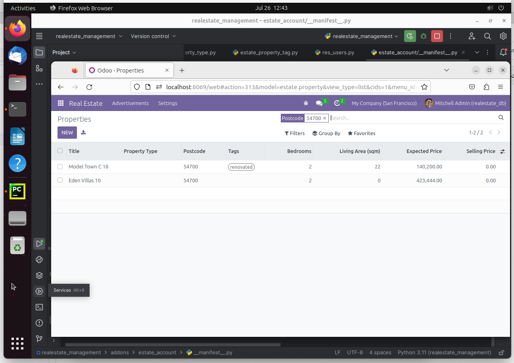

# Odoo-Pre-Internship-Assignment-ID-1
 Pre-internship assignment for axiom world By Behzad Khadim

# Real-Estate-Management Module 

Created a Real Estate Module for listing and managing properties including estate property listings, offers, property informations etc
Each model has its own different view (Tree, Form, Search).

## 0. estate_property model & view:

Here all the real estate properties information and listing will show in these view and there is an option for adding a new property with its complete information. 

Shows all the property lisitng and quick information on the specific row. 

**One2many**: One Property can have many Offers from Buyers  

**Description**: Complete Description about the property along with the calculated area functions  

## 1. estate_property_offer model & view:

Seperate Offers tab for Viewing and Lisitng new Offers with appropriate constrainst and actions  

Offer accepting and refusing buttons with just a click

## 2. Search Filters:

Search Properties on the basis of postcode similarity  

Search Module even in App filter 

Customized Top menu items with appropriate actions 

## 3. Marking Status of the Property:

Setting the property as sold and cancelled using appropriate constrainst by just on click  

## 4. Tags for the Property:

Quick Glancable tags for the property  

## 5. Odoo Version:

Odoo version 16 (commnuity Edition)  

All the development was done using Ubuntu OS running on Virtual Machine using UTM Software on MAC

## 6. Submitted By:

Behzad Khadim 
email: bkicloud2001@gmail.com
for AXiom World 
