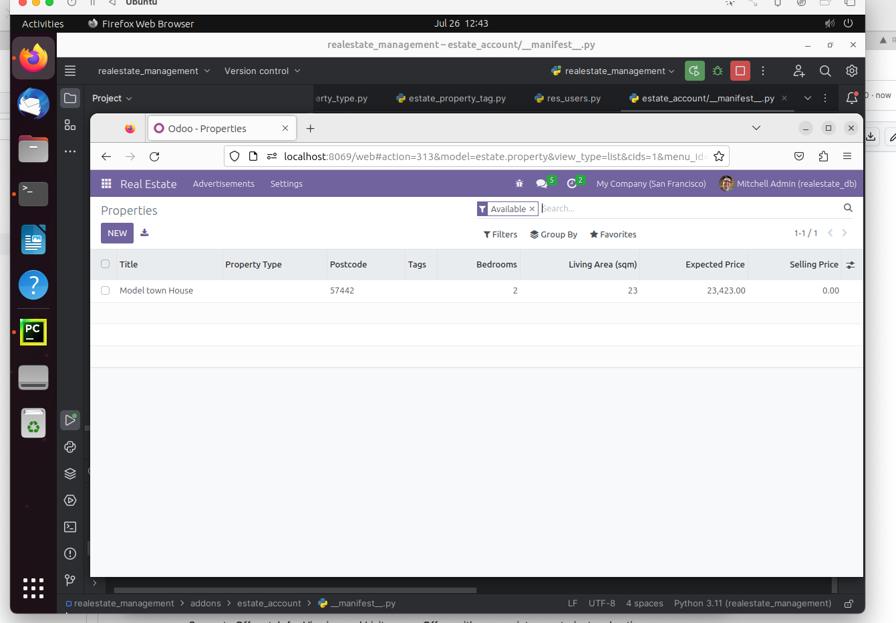
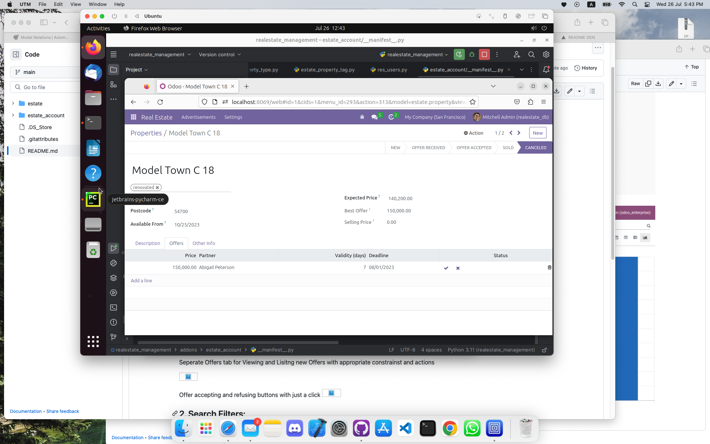
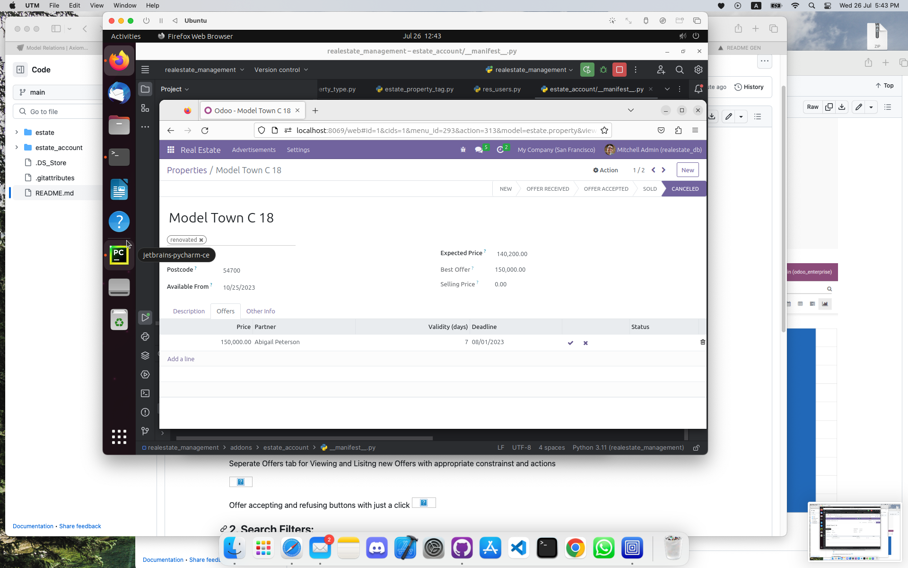
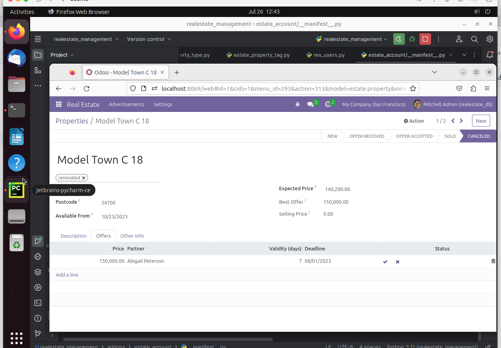
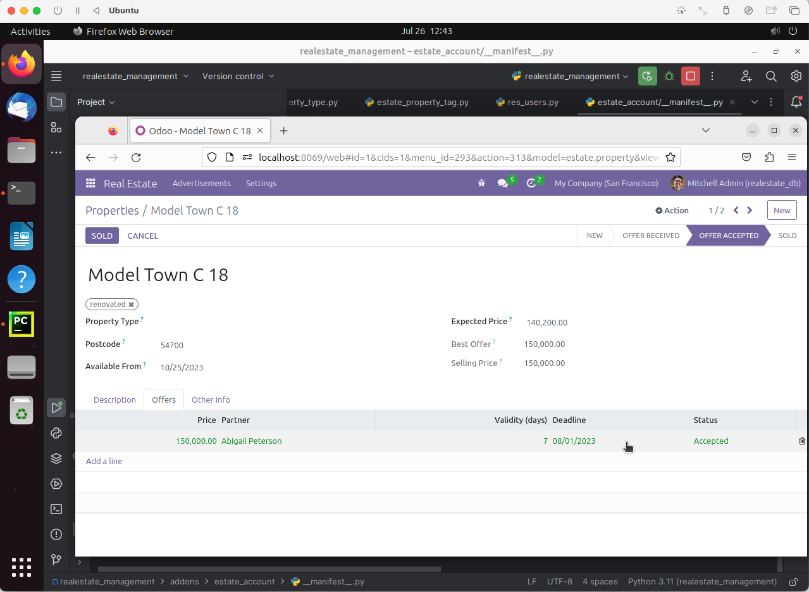

# Odoo-Pre-Internship-Assignment-ID-1
 Pre-internship assignment for axiom world By Behzad Khadim

# Real-Estate-Management Module 

Created a Real Estate Module for listing and managing properties including estate property listings, offers, property informations etc
Each model has its own different view (Tree, Form, Search).

## 0. estate_property model & view:

Here all the real estate properties information and listing will show in these view and there is an option for adding a new property with its complete information. 

Shows all the property lisitng and quick information on the specific row. 

**One2many**: One Property can have many Offers from Buyers  

## 1. estate_property_offer model & view:

Here all the Doctors information will show and there is an option for creating new Doctor information. 

Advanced map view is implemented for showing doctor's location.

## 2. Department model & view:

Here all the Department information will show and there is an option for creating new Department. 

## 3. Appointments model & view:

Here all the Appointments information will show and there is an option for creating new Appointments. 

Appointments list view:

Appointments kanban view:

Appointments calender view:

Appointments pivot view:

Appointments gantt view:

Appointments graph view:
![Appointments9](./picture/17.
